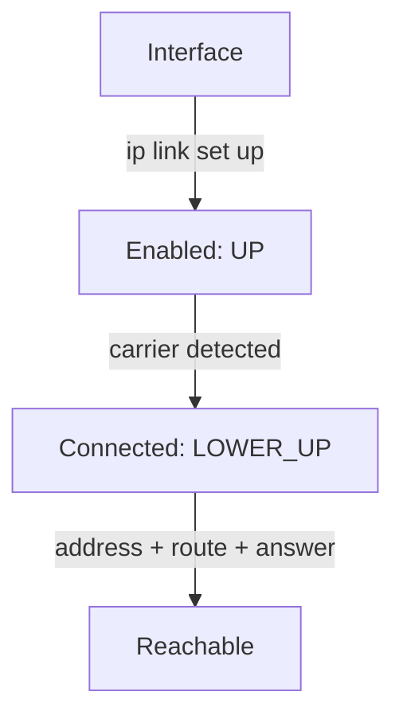

# Antennas And Their State

Astronaut, before you can give your ship a call sign, you need to know which antennas it has and whether each one is switched on. On Linux, those antennas are network interfaces.

This part shows you the one command you use for all of it, how to list the interfaces, and why an interface that says `UP` can still be unable to talk to anyone.

## Words you will meet

These terms come up in this part. Each one is explained again where it first matters.

| Term | Meaning |
| --- | --- |
| **Network interface** | A physical or virtual connection point between the operating system and a network, such as `enp0s1` or `lo`. One antenna on the ship's communications array. |
| **IP address** | The address other hosts use to send Layer 3 signals to this machine, in IPv4 or IPv6 form. The ship's call sign. |
| **UP** | Kernel state meaning the interface is switched on by an administrator. It says nothing about an address or a working link. |
| **MAC address** | The hardware address of an interface, used to deliver frames on the local network segment. The serial number stamped on the antenna. |
| **MTU** | Maximum Transmission Unit: the largest packet the interface sends in one piece. |

## The `ip` command

One command runs through this whole module: `ip`, from the `iproute2` package. It has three subcommands you use here, one for each layer of the problem:

| Subcommand | Layer | Question it answers |
|---|---|---|
| `ip link` | the interface itself (Layer 2) | Is it switched on? What are its MAC address and MTU? |
| `ip addr` | addresses on the interface (Layer 3) | Which IPv4 / IPv6 addresses are bound to it? |
| `ip route` | the routing table | Where does traffic for a given destination go? |

A way to remember it: **link** is the antenna, **addr** is the call sign on the antenna, and **route** is the star chart. Each subcommand takes `show` to read the state. Reading is safe and needs no special rights. `add`, `del` and `set` change the state and need `sudo`. Add `-brief` (or `-br`) to a `show` command to get one tidy line per interface instead of several lines.

## Listing the interfaces

`ip link show` lists every interface the kernel knows about. For each one it prints:

- the name;
- whether it is switched on by an administrator (`UP`) or not (`DOWN`);
- whether a carrier is detected (`LOWER_UP`), that is, whether the antenna actually picks up a partner;
- the **MAC address**, the hardware address used to deliver frames one hop at a time on the local segment, underneath IP;
- the **MTU**, the largest packet in bytes the interface sends in one piece (`1500` is the Ethernet default).

The loopback interface has a MAC address of all zeros, because it never puts a frame on a wire.

### See it in your playground

<!-- astrona:playground:renew -->

List the interfaces on your training ship:

```sh
ip -brief link show
```

The output looked like this when the module was written:

```text
lo               UNKNOWN        00:00:00:00:00:00 <LOOPBACK,UP,LOWER_UP>
enp0s1           UP             52:54:00:11:22:33 <BROADCAST,MULTICAST,UP,LOWER_UP>
enp0s2           UP             52:54:00:aa:bb:cc <BROADCAST,MULTICAST,UP,LOWER_UP>
enp0s3           UP             52:54:00:dd:ee:ff <BROADCAST,MULTICAST,UP,LOWER_UP>
```

You see four interfaces: the loopback `lo`, the management interface that carries your SSH session, and two spare interfaces. This output comes from an earlier version of the playground, where the spare interfaces were called `enp0s2` and `enp0s3`. In your playground they are `netlab-a` and `netlab-b`, and your names and MAC addresses will differ. All the real interfaces read `UP`. Yet one of them has no IP address at all, as the next section shows.

## Does every interface need an IP address?

No. An interface can be switched on with no address on it. But an interface normally needs an address before it can exchange **Layer 3** traffic with any other host. Layer 3 traffic is signals moved between networks by IP address.

One interface can carry:

- no IP address;
- one IPv4 or one IPv6 address;
- several IPv4 and IPv6 addresses at once.

### What `UP` really means

Linux calls a switched-on interface **UP**. `UP` is only the administrative state: the operating system has switched the antenna on. It does not mean the interface has an address, that a cable is plugged in, or that anything can be reached through it.

`ip addr show` lists the addresses bound to each interface. It also repeats the link information from `ip link show`. `ip addr show dev enp0s2` narrows it to one interface.

### See the addresses, including an interface with none

Show the addresses on every interface:

```sh
ip -brief addr show
```

The recorded output:

```text
lo               UNKNOWN        127.0.0.1/8 ::1/128
enp0s1           UP             10.0.0.20/24
enp0s2           UP             192.168.50.10/24 2001:db8:50::10/64
enp0s3           UP
```

`enp0s2` (in your playground: `netlab-a`) holds one IPv4 and one IPv6 address at once, each with its own prefix length (`/24` and `/64`). `enp0s3` (in your playground: `netlab-b`) is `UP` with an empty address column: switched on, but with no routable IP, so it cannot be reached at Layer 3. `lo` shows the standard loopback pair `127.0.0.1/8` and `::1/128`. You may also see an `fe80::` line on interfaces that speak IPv6. That is a link-local address: an IPv6 address every interface gives itself, valid only on its own segment.

### Look at one interface at a time

To see why one interface differs from another, look at them one at a time. `ip link show dev <name>` answers a link question: is it on, is there a carrier, what are its MAC address and MTU? `ip addr show dev <name>` answers a different question: which addresses are bound to it? An interface can pass the first check and have nothing to show for the second.

Use the name of the interface with no address. The example below calls it `enp0s3`; in your playground type `netlab-b` instead:

```sh
ip link show dev enp0s3
ip addr show dev enp0s3
```

The recorded output:

```text
4: enp0s3: <BROADCAST,MULTICAST,UP,LOWER_UP> mtu 1500 qdisc fq_codel state UP mode DEFAULT group default qlen 1000
    link/ether 52:54:00:dd:ee:ff brd ff:ff:ff:ff:ff:ff
```

`ip link show` reports `state UP` with a MAC address and an MTU: the interface is switched on. `ip addr show` for the same interface prints no routable `inet` or `inet6` line. (An `inet6 fe80::…` link-local line may still appear.) That gap is the point. `UP` is an administrative state, not a promise of a usable address or of reachability.

## Enabled, connected, reachable

These are three separate things, and it is easy to mix them up. Learn to tell them apart now, because "it says UP, so why can nobody reach it?" is one of the most common networking questions.

### The three states

- **Enabled (`UP`)** is the administrative state. You, or a service at boot, asked the kernel to switch the interface on. `ip link show` prints `UP` in the flag list and `state UP` at the end of the line.
- **Connected (`LOWER_UP`)** means the kernel detects a carrier: a live partner on the other end, such as a switch port or a virtual segment that is wired up. An interface can be `UP` without `LOWER_UP` when nothing is attached.
- **Reachable** means a signal can actually travel from this ship to another one and back. That needs an address, a route, a working path, and a host at the far end that answers. No flag on an interface can promise it.



Each step needs the one before it, and only the kernel's flags report the first two. Reachability you can only prove by sending a signal and getting an answer.

In your playground, `netlab-a` and `netlab-b` are `dummy` interfaces: practice antennas wired to nothing. You can watch their link state change, but a `ping` to any address beyond the machine's own will not get a reply. Here you see the link-state half only, not the end-to-end half.

### Switch a spare interface off and on

You can change the administrative state yourself with `ip link set`. The commands below are safe **only** on a spare interface. Never run them on the interface that carries your SSH session: switching that one off cuts your link to the machine.

The example uses `enp0s3`; in your playground type `netlab-b` instead:

```sh
sudo ip link set enp0s3 down
ip -brief link show dev enp0s3
sudo ip link set enp0s3 up
ip -brief link show dev enp0s3
```

You get `DOWN` after the first change and `UP` again after the last:

```text
enp0s3           DOWN           52:54:00:dd:ee:ff <BROADCAST,MULTICAST>
enp0s3           UP             52:54:00:dd:ee:ff <BROADCAST,MULTICAST,UP,LOWER_UP>
```

The MAC address never changes; only the state and the flags do. The kernel sets and clears `UP` on command. It is an administrative switch, not a property of the hardware. This change lasts only until the next reboot.

### Flags are not reachability

Seeing `<BROADCAST,MULTICAST,UP,LOWER_UP>` and `state UP` on `enp0s3` tempts you to think "another machine can ping `enp0s3` now". It cannot. Those flags report only the administrative and link state.

Reachability also needs an address on the interface, a route to the other machine, a working path, and a host at the far end that answers. Check the first two with `ip addr show dev enp0s3` and `ip route show`. In the playground `netlab-b` has no address at all, so nothing beyond the machine answers, whatever the flags say.

> [!TIP]
> When something is unreachable, check in this order: `ip link show` (is it on?), `ip addr show` (does it have an address?), `ip route show` (is there a route?). Stop at the first "no".

## Common pitfalls

> [!WARNING]
> - **Reading `UP` as "reachable".** An interface can be `UP`, even `LOWER_UP`, with no address and no route. Confirm with `ip addr show` and `ip route show`, not with `ip link show` alone.
> - **Confusing the MAC address with the IP address.** They belong to different layers. An interface with no IP still has a MAC address, and adding or removing an IP never changes the MAC address.
> - **Switching off the wrong interface.** `ip link set ... down` on the interface that carries your SSH session cuts you off. Only touch the spare interfaces.
