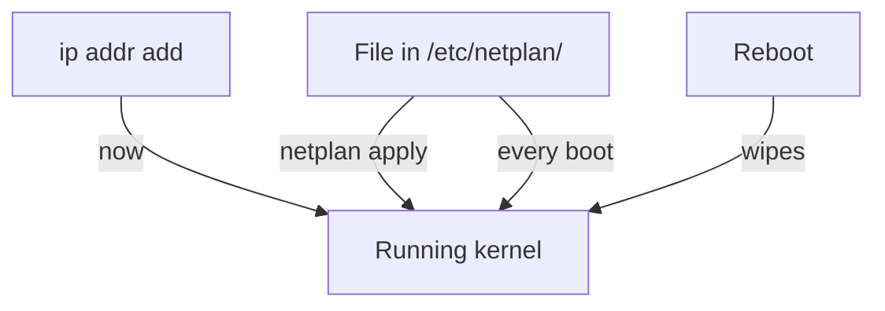

# Runtime Changes And Persistent Configuration

Astronaut, there are two ways to give an antenna a call sign. You can chalk it on the console, where it works right away and is wiped at the next restart. Or you can write it into the flight manual, which the ship reads every time it starts.

This part shows you both, and why the exam almost always wants the second one.

## Runtime changes with `ip`

Everything the `ip` command changes takes effect at once and lives only in the running kernel. That covers an address added with `ip addr add` and a state set with `ip link set`. A reboot clears all of it.

### Verify versus configure

Keep the two kinds of `ip` command apart:

- `ip ... show` and `ip route show` **verify**. They report the current state and change nothing.
- `ip addr add`, `ip addr del` and `ip link set` **configure**. They change the kernel's network state and need `sudo`.

Runtime changes are fine for exploring and for a quick fix. They are not how an address is meant to stay in place.

### Add an address, then remove it

<!-- astrona:playground:renew -->

`sudo` is needed because changing an address changes the kernel's network state. Only ever do this to a spare interface, never to the interface that carries your SSH session. The example uses `enp0s3`; in your playground type `netlab-b` instead:

```sh
sudo ip addr add 192.168.51.20/24 dev enp0s3
ip -brief addr show dev enp0s3
sudo ip addr del 192.168.51.20/24 dev enp0s3
```

The middle command shows:

```text
enp0s3           UP             192.168.51.20/24
```

The address appears at once and is gone again after the `del`. Nothing about this survives a reboot.

## Persistent configuration

To make an address survive a reboot, you write it into the flight manual instead of chalking it on the console. On Linux, that flight manual belongs to the network management system.

### The network management systems

Common Linux distributions use one of three systems: NetworkManager, Netplan or `systemd-networkd`. Each one writes the configuration to disk and applies it again on every boot. On Ubuntu 24.04, Netplan is the flight manual: you write YAML files under `/etc/netplan/`, and `sudo netplan apply` hands them to the communications officer (`systemd-networkd` or NetworkManager) who sets the antennas.

Let only one of these systems manage an interface at a time. Two of them configuring the same interface will fight over it.



An address set with `ip addr add` reaches the kernel once and is wiped at the next reboot. An address declared in a Netplan file reaches the kernel when you apply it, and again at every boot.

### What "persistent" means to a grader

A grader that checks persistence does not reboot the machine. It looks for your address in the on-disk configuration: a file under `/etc/netplan/` or a NetworkManager connection profile. An address added only with `ip addr add` shows up in `ip addr show`, but not in any file, so it does not count.

## Common pitfalls

> [!WARNING]
> - **Expecting `ip` changes to persist.** Anything set with `ip addr add`, `ip addr del` or `ip link set` lives only in the running kernel and is gone after a reboot. Persistent addressing goes through NetworkManager, Netplan or `systemd-networkd`.
> - **Changing the management interface.** Adding, removing or switching off addresses on the interface that carries your SSH session can cut you off. Add next to its address; never replace it.
> - **Letting two systems manage one interface.** NetworkManager and Netplan (or `systemd-networkd`) both configuring the same interface give results that are hard to predict.

## Your mission: IPv4 & IPv6 Interface Configuration Lab

You can now read interfaces and addresses, add an address at runtime, and say what makes it permanent. The mission asks you to add a second IPv4 address and an IPv6 address next to the management address, make both survive a reboot, and give the new address a name in `/etc/hosts`.

The mission runs on its own training ship, so first pause your playground. Nothing in it is lost:

```sh
astrona stop network-interfaces-playground
```

Then start the mission:

```sh
astrona run --git ssh://git@github.com/astrona-io/ATS003.git -c sections/section-010/module-01/labs/lab-01
```

Read the task in [`question.md`](./labs/lab-01/question.md) and solve it on your own first. When you think you are done, send it for grading:

```sh
astrona submit -c sections/section-010/module-01/labs/lab-01
```

When the mission is done, remove it and wake your playground up again:

```sh
astrona destroy ats-003-lab-011
astrona start network-interfaces-playground
```
