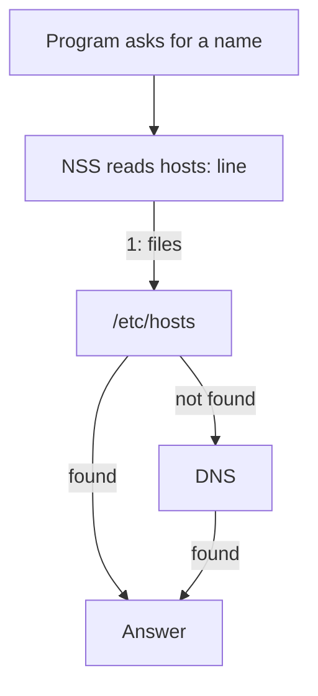

# The Pocket Address Book

Astronaut, before your ship asks the galaxy-wide directory for a call sign, it checks its own pocket address book. On Linux that book is `/etc/hosts`, and a switchboard decides when to read it.

This part shows you how to read the book, how to look a name up the way a real program does, and how to see the order in which the switchboard checks its sources.

## Words you will meet

| Term | Meaning |
|---|---|
| **Name resolution** | Turning a name into an IP address, or the reverse. |
| **`/etc/hosts`** | A plain-text file of fixed `IP name [aliases]` mappings, local to one machine. The ship's own pocket address book. |
| **Canonical hostname** | The first name after the IP on an `/etc/hosts` line; any more names on the line are aliases. |
| **Loopback address** | Any address in `127.0.0.0/8` (IPv4) or `::1` (IPv6). Traffic to it never leaves the machine, like the ship's internal intercom. |
| **NSS** | Name Service Switch: the mechanism that decides which sources to check, and in what order. It is set up in `/etc/nsswitch.conf`. |
| **`getent`** | A tool that does a lookup through NSS, exactly as a normal program would. |
| **DNS** | The network-wide name service, the galaxy-wide directory of call signs. Here it appears only as a contrast. |

## `/etc/hosts`: fixed name-to-address mappings

`/etc/hosts` holds fixed mappings, one per line, in this form:

```text
IP_ADDRESS   CANONICAL_HOSTNAME   [ALIAS ...]
```

### Reading one line

For example:

```text
192.168.1.50 prod-app-01 app-server
```

Here `192.168.1.50` is the address, `prod-app-01` is the **canonical hostname** (the main name), and `app-server` is an alias. Both names resolve to the same address. Separate the fields with one or more spaces or tabs.

### Read the book your playground starts with

<!-- astrona:playground:renew -->

Print the file:

```sh
cat /etc/hosts
```

The output looked like this when the module was written:

```text
127.0.0.1 localhost
::1 localhost ip6-localhost ip6-loopback
127.0.1.1 prod-app-01 app-server
192.168.50.10 db-primary db
```

The playground set the static hostname to `prod-app-01` and mapped it to the loopback address `127.0.1.1`, with `app-server` as an alias. The last line maps `db-primary` (alias `db`) to an address outside the machine. Nothing listens there; it exists so you can see a name resolve to an interface-style address. The exact contents vary with the image.

## `getent`: look up a name the way a program does

Reading `/etc/hosts` with `cat` shows what is *in the file*. It does not tell you what the system would actually return for a name. That depends on NSS and on every source it is set to check.

### How `getent` works

`getent` (read it as *get entries*) asks an NSS database directly, using the same sources and order as a normal program:

```bash
getent hosts prod-app-01
```

`hosts` is the database name. `getent` has other databases (`passwd`, `group` and so on); `hosts` is the one for name resolution. Two more specific forms return address records only:

```bash
getent ahostsv4 prod-app-01     # IPv4 answers
getent ahostsv6 prod-app-01     # IPv6 answers
```

`getent` only reads and changes nothing.

### Resolve the prepared names through NSS

Look up the three prepared names:

```sh
getent hosts prod-app-01
getent hosts app-server
getent hosts db-primary
```

The recorded output:

```text
127.0.1.1       prod-app-01 app-server
127.0.1.1       prod-app-01 app-server
192.168.50.10   db-primary db
```

The canonical name and its alias resolve to the same address: `getent` returns the whole matching line either way. `db-primary` resolves to its interface-style address. Every one of these answers came from `/etc/hosts`, because that is the only source with anything to say on this network.

## The lookup order: `/etc/nsswitch.conf`

NSS decides which sources to check, and in what order. Its configuration is `/etc/nsswitch.conf`, and the line that matters here starts with `hosts:`. That order is why an entry in `/etc/hosts` can win over DNS.

### Reading the `hosts:` line

Print the line:

```bash
grep '^hosts:' /etc/nsswitch.conf
```

A minimal line reads:

```text
hosts: files dns
```

`files` means local files such as `/etc/hosts`; `dns` means the configured DNS service. NSS checks the sources **from left to right**, and the first answer wins. So `files` before `dns` means `/etc/hosts` is checked before DNS, and an entry there overrides whatever DNS would say for the same name.



The diagram shows the `hosts: files dns` order: NSS asks `/etc/hosts` first and only asks DNS when the file has no match.

### Other sources you may see

A current system often lists more sources:

```text
hosts: files mdns4_minimal resolve dns
```

- `files` is `/etc/hosts`;
- `resolve` is `systemd-resolved`;
- `mdns4_minimal` and `mdns` are multicast DNS, for `*.local` names;
- `myhostname` is the machine's own hostname, through an NSS module.

Do not change this line unless you understand the machine's resolution setup. A wrong order can stop both local *and* network names from resolving.

### See which sources your machine checks

Show the `hosts:` line on your training ship:

```sh
grep '^hosts:' /etc/nsswitch.conf
```

The recorded output, shortened:

```text
hosts: files ... dns
```

`files` sits before `dns`, so every lookup checks `/etc/hosts` first and only falls through to DNS when the file has no match. That order is why the entries in `/etc/hosts` win over anything a DNS server might say. In this playground there is no DNS server, so the `dns` step never returns anything: `files` is the whole story here.

## Common pitfalls

> [!WARNING]
> - **Reading `/etc/hosts` with `cat` and calling it checked.** The file is one source, and NSS may check others first. `getent` shows what the system actually returns.
> - **Changing the `hosts:` line without a reason.** A wrong order in `/etc/nsswitch.conf` can break both local and network names.
> - **Mixing up the canonical name and the alias.** Both resolve to the same address, but the first name after the address is the canonical one.
