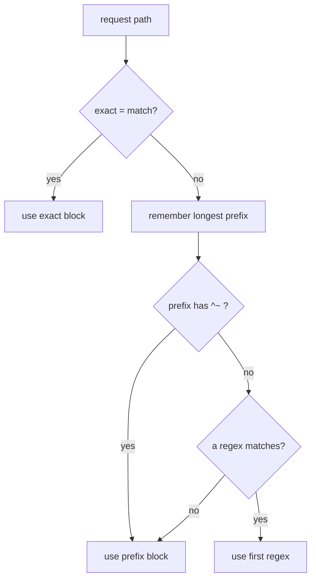

# Headers And Location Matching

Astronaut, the docking control tower now forwards visitors, but it hides who they are. The backend sees the tower's own call sign, not the visitor's. This part shows how to pass the visitor's details on with headers, and then how NGINX picks one `location` when several could match a request.

## Passing the client's Host and IP

By default NGINX sends the backend a `Host` header equal to the `proxy_pass` target (`127.0.0.1:9001`), not the name the client used. The backend also sees NGINX's own address as the client. This section fixes both.

### Why the backend needs them

A backend that serves several sites, builds full web addresses, or logs the host name needs the original `Host`. It also needs the real client IP (Internet Protocol) address, the visitor's call sign, for its logs and rules. Because the backend only sees the tower connecting, the real address must travel in a header the backend agrees to read.

The usual set of `proxy_set_header` lines is:

```nginx
location /a/ {
    proxy_pass http://127.0.0.1:9001/;
    proxy_set_header Host              $host;
    proxy_set_header X-Real-IP         $remote_addr;
    proxy_set_header X-Forwarded-For   $proxy_add_x_forwarded_for;
    proxy_set_header X-Forwarded-Proto $scheme;
}
```

### See the difference in your playground

First, with only `proxy_pass` in the `location /a/` block (no `proxy_set_header` lines), send a request with your own `Host` header and read the echo:

<!-- astrona:playground:renew -->

```sh
curl -s -H 'Host: shop.example' http://localhost/a/hello | grep -E '^host|^x-'
```

The backend sees NGINX's target, not `shop.example`, and no forwarding headers:

```text
host      : 127.0.0.1:9001
```

Now change the block to the one with the four `proxy_set_header` lines above, and apply it:

```sh
sudo nginx -t && sudo systemctl reload nginx
```

Then run the same `curl` again:

```sh
curl -s -H 'Host: shop.example' http://localhost/a/hello | grep -E '^host|^x-'
```

```text
host      : shop.example
x-real-ip : 127.0.0.1
x-forwarded-for: 127.0.0.1
x-forwarded-proto: http
```

`$host` carried the client's `Host` through. `$remote_addr` is the client address as NGINX sees it. Here it is `127.0.0.1`, because `curl` runs on the same machine.

`X-Forwarded-For` is just a header, so a client can send a fake one. Only trust it on the hop you control, and set up the backend (or NGINX's `real_ip` module) to trust only the proxy's address.

## How NGINX picks a `location`

When several `location` blocks could match a request, NGINX does **not** simply take the first one in the file. It follows a fixed order, and one step in it surprises almost everyone.

### The matching order

1. An exact match, `location = /health`, wins immediately.
2. Otherwise, NGINX remembers the **longest matching prefix**.
3. If that prefix block is marked `^~`, NGINX uses it and stops.
4. Otherwise, it tries the regular expression blocks (`location ~ \.json$`, or `~*` to ignore upper and lower case) **in file order**. The first one that matches wins.
5. If no regular expression matched, NGINX uses the remembered longest prefix.



The diagram shows that a regular expression is checked after the prefix is remembered, so it can still win.

### Watch a regular expression beat a prefix

Add these three blocks inside the `server`, then apply:

```nginx
location = /a/exact { proxy_pass http://127.0.0.1:9001/exact-hit; }
location /a/        { proxy_pass http://127.0.0.1:9001/prefix-hit; }
location ~ /a/.*\.json$ { proxy_pass http://127.0.0.1:9002/regex-hit; }
```

```sh
sudo nginx -t && sudo systemctl reload nginx
```

Then send three requests:

```sh
curl -s http://localhost/a/exact       | grep -E '^backend|^path'
curl -s http://localhost/a/thing       | grep -E '^backend|^path'
curl -s http://localhost/a/thing.json  | grep -E '^backend|^path'
```

You get the exact match, then the prefix, then the regular expression, which goes to `backend-b`:

```text
backend   : backend-a ...   path : /exact-hit
backend   : backend-a ...   path : /prefix-hit
backend   : backend-b ...   path : /regex-hit
```

(Shortened: each answer's `backend` and `path` lines are shown on one line.)

`/a/thing.json` also matched the `/a/` prefix. But the regular expression was tried after the prefix was remembered, and it won.

## Common pitfalls

> [!WARNING]
> - **Forgetting `proxy_set_header Host $host;`.** The backend receives `Host: 127.0.0.1:9001`, which breaks name-based virtual hosts, redirects and logs.
> - **Trusting `X-Forwarded-For` blindly.** A client can fake it. Only believe it on the hop you control.
> - **A regular expression `location` beating a longer prefix.** Unless the prefix block uses `^~`, regular expression blocks are tried after it and can win. Check the matching order when a request goes somewhere you did not expect.
