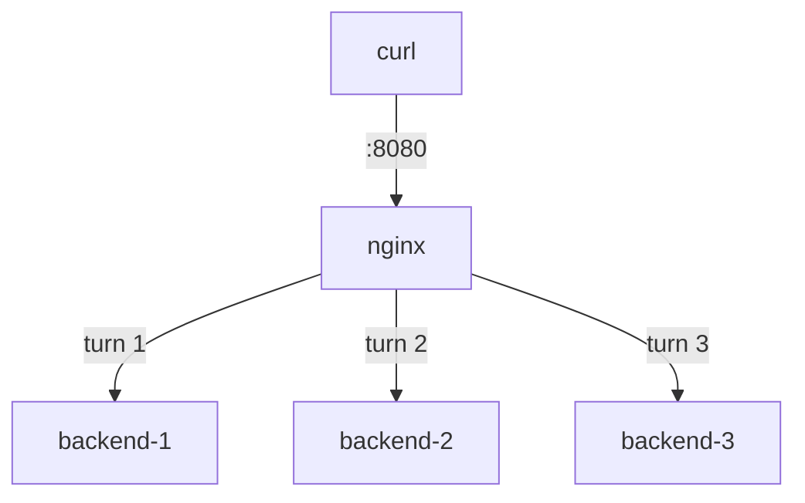

# The Pool And Round-Robin

Astronaut, your docking control tower already guards three bays on port 8080. In this part you look at the group of bays the tower uses, the order in which it fills them, and how to give one bay a bigger share.

## The `upstream` pool

A load balancer is a reverse proxy whose `proxy_pass` points at a named pool. The pool is an `upstream` block: the list of bays behind the tower.

### What a pool looks like

The pool is declared in the `http { }` context, next to a `server` block, not inside it:

```nginx
upstream app_pool {
    server 127.0.0.1:9001;
    server 127.0.0.1:9002;
    server 127.0.0.1:9003;
}

server {
    location / {
        proxy_pass http://app_pool;
    }
}
```

Every request to that `location` now goes to one of the three backends.



The diagram shows NGINX handing each new request to the next backend in turn. The backends are `127.0.0.1:9001`, `:9002` and `:9003`.

### Read your playground's pool

Your playground's load balancer lives in `/etc/nginx/conf.d/lb.conf`. Print it:

<!-- astrona:playground:renew -->

```sh
cat /etc/nginx/conf.d/lb.conf
```

Look for the `upstream app_pool` block with the three `server` lines, and a `server` block with `listen 8080;` whose `location /` has `proxy_pass http://app_pool;`. A commented-out `proxy_next_upstream` line waits there for later.

## Design rules the directives do not check

NGINX accepts any pool you write. Two design points decide whether the pool really works, and NGINX checks neither of them for you.

### Layer 7 and Layer 4

This is **Layer 7** load balancing: NGINX reads each HTTP request and can pick a backend by web address, header or cookie. A **Layer 4** balancer (NGINX's own `stream {}` module, HAProxy in TCP mode, or a cloud load balancer) forwards raw TCP (Transmission Control Protocol) without reading it. That is less flexible and costs less work, and it also works for protocols that are not HTTP.

### Interchangeable bays and a spare tower

The backends in a pool must be **interchangeable**. If a user's session lives in one backend's memory, plain round-robin logs them out on the next request. You then need stickiness with `ip_hash` or `hash`, or better, a shared session store so the backends hold no state of their own.

The load balancer itself is now a **single point of failure**. Production setups run two, with a floating IP address (keepalived), DNS or anycast in front. The `proxy_set_header Host` and `X-Forwarded-For` lines still apply to every backend in a pool.

## Round-robin, the default

With no method line in the pool, NGINX uses **weighted round-robin**: it hands requests to each server in turn. A `weight=N` on a server multiplies its share. You see the even baseline first, then change the ratio.

### The even baseline

Send twelve requests and count which backend answered:

```sh
for i in $(seq 12); do curl -s http://localhost:8080/ | grep '^backend'; done | sort | uniq -c
```

```text
      4 backend : backend-1 (127.0.0.1:9001)
      4 backend : backend-2 (127.0.0.1:9002)
      4 backend : backend-3 (127.0.0.1:9003)
```

Twelve requests, four each: plain round-robin. Every other method is a change from this split.

### Give one backend a bigger share

When backends are not equal, for example one machine has more processor power, or you move traffic onto a new machine step by step, `weight` changes the ratio without changing the rotation. `weight=3` means that server is picked three times for every one time a `weight=1` server is.

In `lb.conf`, change the first line of the pool to:

```nginx
server 127.0.0.1:9001 weight=3;
```

Apply it:

```sh
sudo nginx -t && sudo systemctl reload nginx
```

Then check the result with more requests:

```sh
for i in $(seq 15); do curl -s http://localhost:8080/ | grep '^backend'; done | sort | uniq -c
```

You get roughly a 3 : 1 : 1 split:

```text
      9 backend : backend-1 ...
      3 backend : backend-2 ...
      3 backend : backend-3 ...
```

(Shortened: the backend addresses are cut.)

`backend-1` took three shares to the others' one each. Set the weight back to `1`, or remove it, before you go on.

> [!TIP]
> Count, do not eyeball. Piping a loop of `curl` requests through `sort | uniq -c` turns a scrolling list into a split you can compare, and it works for every balancing method.

## Common pitfalls

> [!WARNING]
> - **Stateful backends with round-robin.** If a session is held in one backend's memory, spreading requests breaks it. Make the backends stateless, or add stickiness on purpose.
> - **Forgetting the load balancer is one machine.** One NGINX in front of three backends is still a single point of failure.
> - **Leaving a test weight in place.** A `weight=3` left over from an experiment quietly skews every later test. Reset the pool after each change.

## Your mission: Nginx Upstream Load Balancers Lab

You can now build an `upstream` pool and point a `proxy_pass` at it. The mission asks you to put a load balancer over two existing apps on one port, and a proxy that sends every path to one fixed page of an app on another port, without changing the apps.

The mission runs on its own training ship, so first pause your playground. Nothing in it is lost:

```sh
astrona stop nginx-lb-playground
```

Then start the mission:

```sh
astrona run --git ssh://git@github.com/astrona-io/ATS003.git -c sections/section-050/module-02/labs/lab-01
```

Read the task in [`question.md`](./labs/lab-01/question.md) and solve it on your own first. When you think you are done, send it for grading:

```sh
astrona submit -c sections/section-050/module-02/labs/lab-01
```

When the mission is done, remove it and wake your playground up again:

```sh
astrona destroy ats-003-lab-052
astrona start nginx-lb-playground
```
